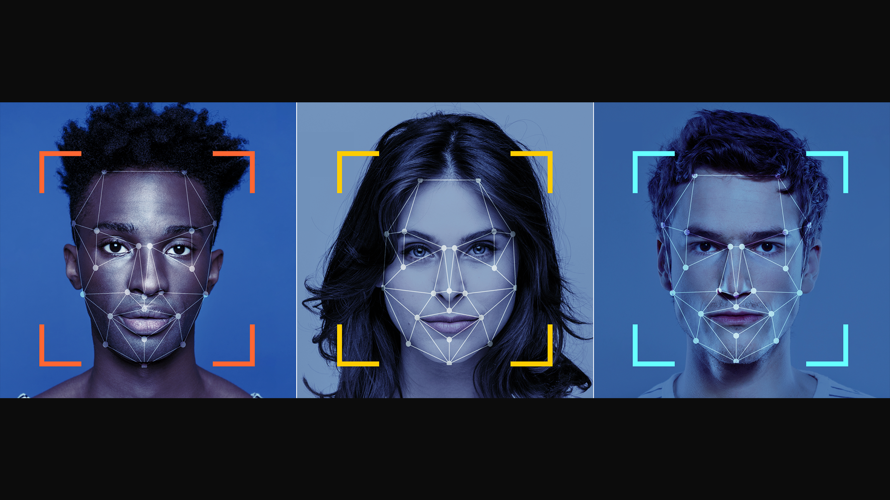

# CNN Projects
Personnal training projects on deep learning CNN algorithms

### 1.  Kaggle dataset: Four Shapes - shape recognition algorithm
<a href="https://www.kaggle.com/victorbnnt/100-accuracy-shape-recognition" target="_blank">
100% accuracy - Shape recognition: notebook</a>

### 2.  Kaggle dataset: Flowers Recognition
<a href="https://www.kaggle.com/victorbnnt/data-augmentation-flowers-classification" target="_blank">
Data augmentation - Flowers classification: notebook</a>

### 3.  Kaggle dataset: Chest X-Ray Images (Pneumonia)
<a href="https://www.kaggle.com/victorbnnt/97-accuracy-chest-x-ray-classification" target="_blank">
97% accuracy chest-X-ray-classification</a>

